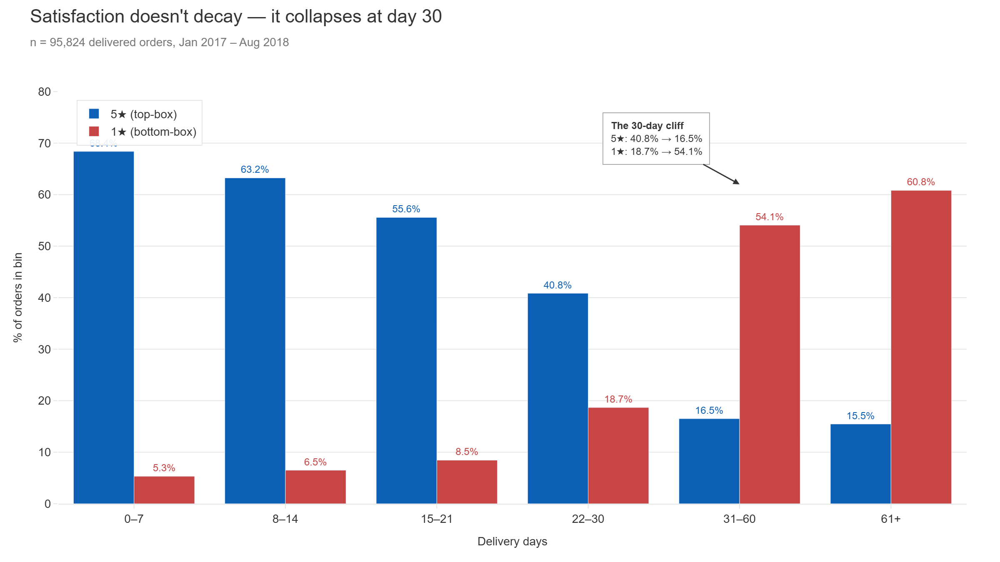
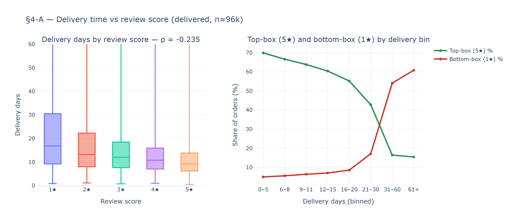
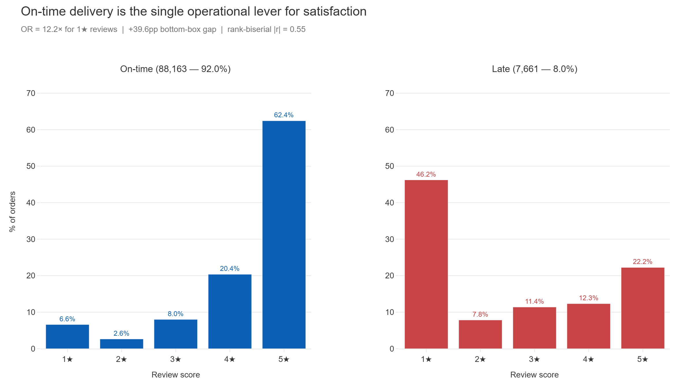
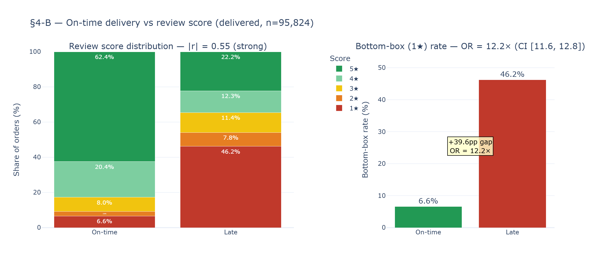
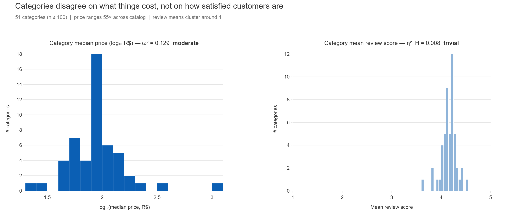
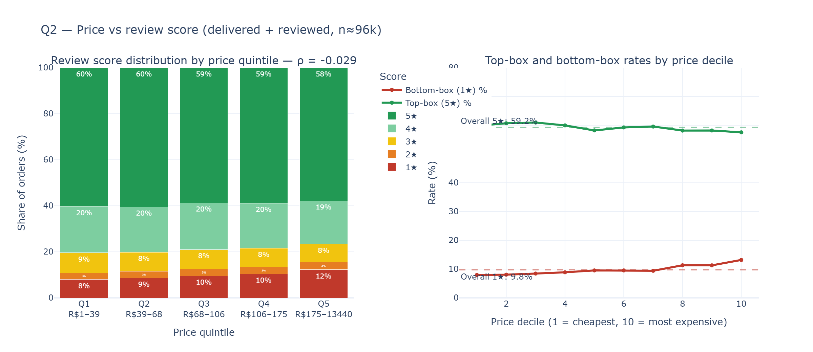
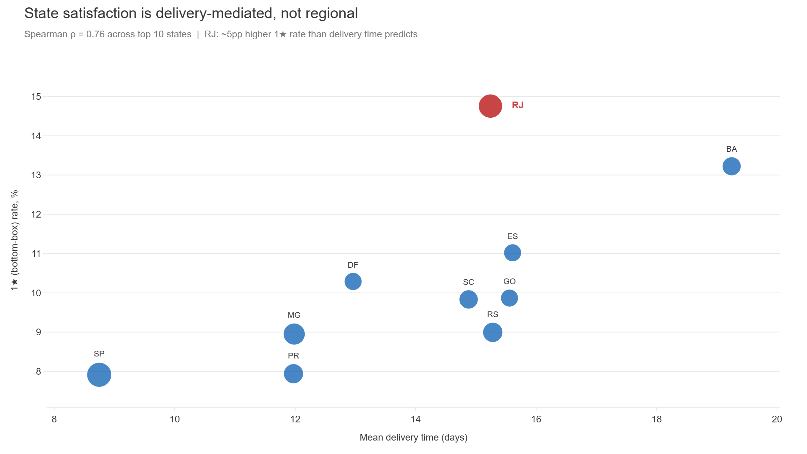
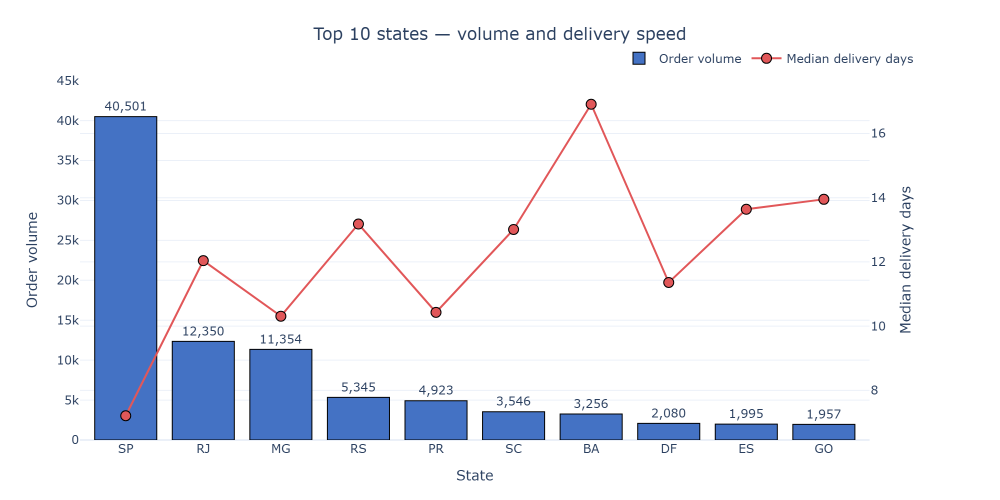
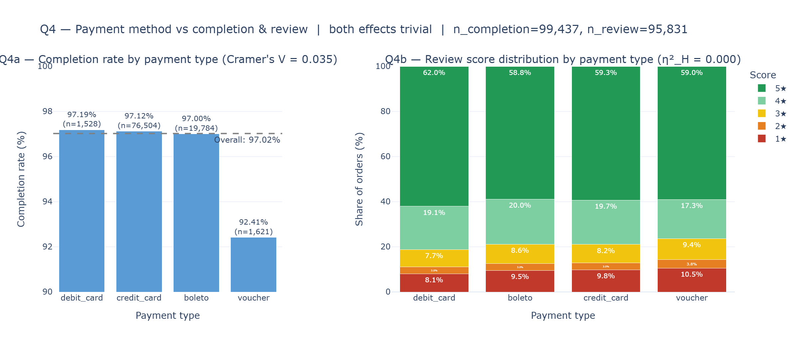
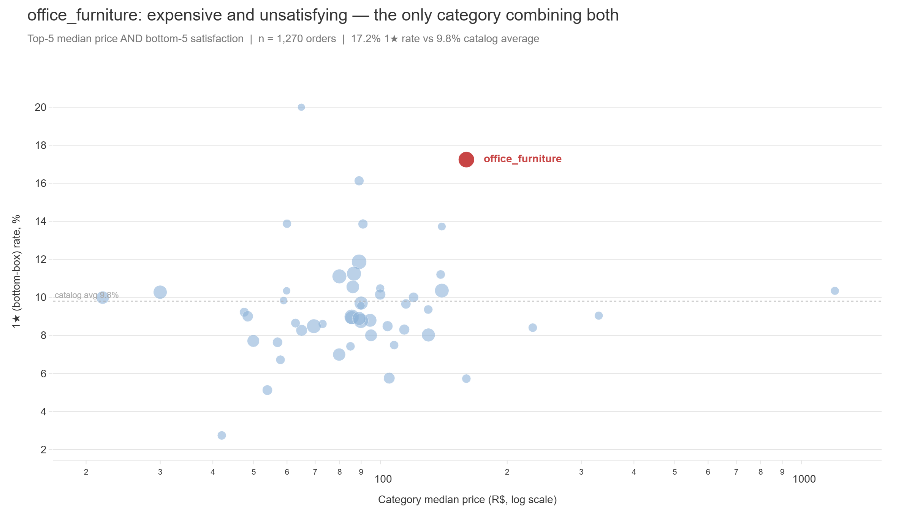

# Olist E-commerce Analysis

**Why are some Olist customers furious and others delighted — and is it the price, the product, or the way it shows up at the door?**

I took ~99k orders, nine joined CSVs, and the full apparatus of nonparametric hypothesis testing to find out which factors *actually* move customer satisfaction on Brazil's largest e-commerce aggregator — and which ones only look like they do.

The thesis came out sharp:

> **Delivery is the entire story. Price, category, and payment type are noise.**

---

## The Problem

Every e-commerce dashboard tracks the same things — average delivery time, category mix, payment funnel, regional volume. Most analyses follow the same playbook: rank states by satisfaction, rank categories by rating, slice price tiers, declare insights. That's how you end up with *"customers in Bahia are less satisfied"* as a finding, when the real pattern is that Bahia takes longer to ship to. Or how you end up tweaking pricing on the assumption that it drives reviews, when the data says it almost certainly doesn't.

This project tests four claims that everyone already "knows" — that price moves satisfaction, that category moves satisfaction, that payment method moves satisfaction, and that some Brazilian states are just harder to please. **Three of them collapse on contact.** One survives in a way nobody who's seen the dashboard would have predicted.

## The Data

| Source | What | Scale |
|---|---|---|
| Olist orders | Order metadata, statuses, timestamps | 99,441 orders |
| Olist order_items | Line items with prices, freight, sellers | 112,650 rows |
| Olist payments | Payment type, installments, value | 103,886 rows |
| Olist reviews | Customer review scores 1–5 + free text | 99,224 reviews |
| Olist customers, products, sellers, geolocation, category-translation | Dimensional tables | 9 CSVs total |

Joined into one order-level parquet (`orders_master.parquet`, ~16 MB, 26 columns). Analytical window: **Jan 2017 – Aug 2018**, 20 full months of consistent coverage. Satisfaction tests restricted to **delivered orders only** — n ≈ 96k.

---

## What I Found

### Satisfaction doesn't decay. It collapses at day 30.



Spearman ρ between delivery days and review score = **−0.235**. Cohen's thresholds call that "weak." The label is wrong. When you bin delivery time, the structure shows up immediately: 5★ rates run **68% / 63% / 56% / 41%** across the 0–7, 8–14, 15–21, 22–30 day buckets — and then crash to **16.5%** in the 31–60 day bucket. 1★ rates mirror it inversely: **5% / 7% / 9% / 19% / 54%**. The damage isn't gradient-shaped. It's threshold-shaped, and rank correlations averaging across the full distribution dilute it into a "weak" label.

Operationally: **shaving two days off median delivery changes very little. Eliminating the 31+ day tail changes everything.**



The continuous boxplot (left) shows the same effect mushed flat by the rank correlation. The threshold-binned view (right) is honest. Same data, opposite stories.

### On-time delivery is the operational lever. Full stop.



Reframe the question against Olist's *own promised delivery date*, and the effect becomes impossible to miss. On-time orders show a healthy distribution: **62.4% 5★, 6.6% 1★**. Late orders show an inverted one: **22.2% 5★, 46.2% 1★**. Bottom-box gap = +39.6 percentage points. Odds ratio for receiving a 1★ review when an order is late: **12.2× (CI [11.6, 12.8])**.

Rank-biserial **|r| = 0.55** — Cohen-labeled "strong" — describes the same underlying phenomenon as the "weak" Spearman ρ above. Same data. Different framing. Opposite labels. **Effect-size labels are artifacts of how you frame the question, not facts about the world.**



This is the one finding I'd put in front of an Olist operations team and let them argue with. They wouldn't.

### Price doesn't move satisfaction. Category doesn't either.



If satisfaction were driven by *what* customers buy, expensive things would get different reviews than cheap things, and luxury categories would post different scores than commodity ones. Neither is true.

Across 51 categories (n ≥ 100 each), median prices range **55×** — from R$22 (electronics) to R$1,250 (computers). Yet category mean review scores cluster between **3.65 and 4.54**. η²_H = 0.008. **Trivial.** The same categories that disagree dramatically on what things cost (ω² = 0.129, moderate) agree almost exactly on how satisfied customers are once delivered.

For price specifically: Spearman ρ between order price and review score = **−0.029**. Functionally zero.



This null result is the most important finding in the project, and it's only possible to see clearly because the analysis treats review score as ordinal and uses effect-size primacy. At n ≈ 96k, every test except one (Q4b on payment, p = 0.060) achieved p < 1e-19 — including this one. **The p-value says "not exactly zero." The effect size says "doesn't matter."** Confusing those two is how you end up running A/B tests on price points trying to nudge a satisfaction metric that price was never going to move.

The chain that explains it: price weakly predicts delivery time (ρ = +0.102), delivery time weakly predicts review score (ρ = −0.235), and the indirect-path product (+0.102 × −0.235 = −0.024) matches the observed direct correlation almost exactly. Price's effect on satisfaction, to whatever degree it exists, is fully delivery-mediated.

### State satisfaction is delivery-mediated, not regional.



Customers in some Brazilian states leave worse reviews than customers in others. The naive read is regional preference. The data says no: across the **top 10 states by order volume, Spearman ρ between mean delivery time and 1★ rate = 0.76**. The whole-population ρ between state-level mean delivery and state-level mean review = **−0.796** (n=10 states). States are dissatisfied because deliveries take longer there, not because their populations are harder to please.



One residual is worth flagging. **Rio de Janeiro** sits ~5pp above the trendline its delivery time predicts. Its mean delivery matches Santa Catarina, Goiás, and Rio Grande do Sul, but its 1★ rate runs measurably higher. That gap isn't explained by speed. It points to a last-mile or carrier-handoff problem specific to RJ — the kind of pattern an operator could investigate.

### Payment method does almost nothing. Almost.



Cramer's V for payment type → completion rate = **0.035** (trivial). η²_H for payment type → review score ≈ **0.000**, p = 0.060 (the only non-significant test in the project — informative precisely *because* failing to reach significance at this n means the effect is genuinely zero). One narrow exception: **voucher orders complete at 92.4% vs. ~97% for everything else.** Tiny in scope (1.6% of orders), real in magnitude. Most likely a customer-intent composition story (promo-driven buyers vs. genuine buyers) rather than a payment-infrastructure failure — but you'd need intent data joined in to confirm.

### One category breaks the consistency pattern.



Of 51 categories tested, the variance in review scores is trivial — except for **office_furniture**. It's the only category that combines top-5 median price (R$163) with bottom-5 satisfaction (3.65 mean, 17.2% 1★ rate vs. 9.8% catalog average, n=1,270). Plausible mechanisms — bulk-shipping damage, assembly complexity, expectation-price mismatch — can't be confirmed from order-level data alone. A retention study using the review text would be the natural follow-up.

---

## Methodology

Nine statistical tests, all rank-based or proportion-based, because review score is ordinal and treating it as interval is the most common analytical mistake on this kind of data.

| # | Question | Test | Effect size | Verdict |
|---|---|---|---|---|
| Q1 | price → delivery | Spearman ρ | ρ = +0.102 | weak |
| §4-A | delivery → review | Spearman ρ | ρ = −0.235 — **30-day cliff** | headline |
| §4-B | on-time → review | Mann-Whitney + 2-prop z | \|r\| = 0.55; OR = 12.2× | **headline** |
| Q2 | price → review | Spearman ρ | ρ = −0.029 | trivial |
| Q3 | category → review | Kruskal-Wallis + Dunn's | η²_H = 0.008 | trivial |
| Q4a | payment → completion | χ² + Cramer's V | V = 0.035 | trivial |
| Q4b | payment → review | Kruskal-Wallis | η²_H ≈ 0; p = 0.060 | trivial |
| §1 | category → log₁₀(price) | Welch's ANOVA + Games-Howell | ω² = 0.129 | moderate |

**Five methodological decisions worth stating:**

**Review score is ordinal.** Top-box (5★) and bottom-box (1★) rates are the primary KPIs. The mean is reported only when comparing to literature. All hypothesis tests are rank-based.

**Effect size > p-value.** At n ≈ 96k, p-values are nearly useless for separating real effects from noise — significance is near-universal. The interpretation key is Cohen's thresholds: ρ/|r|/V < 0.10 trivial, < 0.30 weak, < 0.50 moderate, ≥ 0.50 strong. η²_H/ω² < 0.01 trivial, < 0.06 small, < 0.14 moderate, ≥ 0.14 large.

**Bootstrap CIs on ρ** use 2,000 paired resamples (percentile method, seed = 42).

**Min-n = 100 per category** for category-level tests. Drops 20 of 71 categories (0.8% of sample) for cleaner rank statistics and a tractable Dunn's pairwise matrix.

**Price uses `items_price_total` (freight excluded).** Including freight would autocorrelate the predictor with the delivery-time outcome, inflating the apparent price-effect.

[Full notebook list](#full-analysis-details) below.

---

## Limitations

**Observational, not causal.** I identify correlations and a clean mediation pattern (price → delivery → review). I don't rule out unmeasured confounders.

**Reviews dated before delivery (~8.5%) were retained, not filtered.** These are customers leaving dispute reviews while still waiting for late shipments — the most dissatisfied segment in the dataset. Removing them would bias top-box rates upward and systematically understate the very delivery-satisfaction relationship the analysis identifies as primary. The decision is a deliberate one, documented in `notebooks/02_descriptive_stats.ipynb`.

**Analytical window: Jan 2017 – Aug 2018.** Excludes late 2016 (low coverage) and Sep 2018 onward (partial month). Black Friday 2017 retained after verifying review-coverage flatness.

**office_furniture is flagged but not explained.** The order-level data can identify the anomaly. It can't tell you why. The natural next step is review-text NLP on that category.

---

## Full Analysis Details

| # | Notebook | What it does | Key output |
|---|---|---|---|
| 01 | [exploration.ipynb](notebooks/01_exploration.ipynb) | Load 9 CSVs, join to order grain, sanity-check, define `on_time` against Olist's promised date | `orders_master.parquet` |
| 02 | [descriptive_stats.ipynb](notebooks/02_descriptive_stats.ipynb) | Univariate distributions, KPI definitions, review-coverage audit, negative-lag investigation | 6 figures, KPI baselines |
| 03 | [hypothesis_tests.ipynb](notebooks/03_hypothesis_tests.ipynb) | All 9 statistical tests, bootstrap CIs, Dunn's & Games-Howell post-hoc matrices | 7 figures, full results |
| 04 | [report_assets.ipynb](notebooks/04_report_assets.ipynb) | Slide-native figure regeneration + 14-slide PPTX deck assembly via python-pptx | 5 slide figures + deck |

**18 figures total** in `reports/figures/`. The deck distills them into the four findings above plus methodology, limitations, and appendix.

---

## Architecture

```
9 CSVs → Joined parquet → Statistical tests → Slide-native figures → PPTX deck
```

- **Data layer:** Pandas + PyArrow, single-file parquet (no warehouse needed at this scale)
- **Stats layer:** SciPy (Spearman, Mann-Whitney, Kruskal-Wallis, χ², bootstrap), statsmodels (Welch's ANOVA, two-prop z), pingouin (effect-size helpers), scikit-posthocs (Dunn's, Games-Howell)
- **Viz layer:** Plotly with kaleido for static export, separate styling for analysis figures vs. slide-native figures
- **Reporting layer:** python-pptx for programmatic deck assembly, LibreOffice for PDF export
- **Stack:** Python 3.12 · pandas · NumPy · SciPy · statsmodels · pingouin · scikit-posthocs · Plotly · python-pptx · Jupyter

## Project Structure

```
olist-ecommerce-analysis/
├── data/
│   ├── raw/                          # 9 source CSVs (gitignored, ~126 MB)
│   └── processed/
│       └── orders_master.parquet     # Joined order-level table (gitignored, ~16 MB)
├── notebooks/
│   ├── 01_exploration.ipynb          # Loading, joins, sanity checks
│   ├── 02_descriptive_stats.ipynb    # KPIs, distributions, audits
│   ├── 03_hypothesis_tests.ipynb     # 9 tests, bootstrap CIs, post-hoc
│   └── 04_report_assets.ipynb        # Slide figures + PPTX assembly
├── reports/
│   ├── figures/                      # 13 analysis figures + 5 slide-native
│   └── olist_deck.pptx               # 14-slide portfolio deck
├── requirements.txt
├── .gitignore
└── README.md
```

## Reproducing the Analysis

```bash
# Clone
git clone https://github.com/workintechpoyrazaka-sketch/olist-ecommerce-analysis.git
cd olist-ecommerce-analysis

# Environment (Python 3.12+)
python -m venv venv
source venv/bin/activate              # Windows: venv\Scripts\activate
pip install -r requirements.txt

# Jupyter kernel
python -m ipykernel install --user --name olist-venv --display-name "Olist venv"
```

Place the 9 [Olist Kaggle CSVs](https://www.kaggle.com/datasets/olistbr/brazilian-ecommerce) in `data/raw/`, then run notebooks in order **01 → 02 → 03 → 04**. Notebook 01 produces the joined parquet that everything else depends on.

Notebook 04 auto-exports the deck to PDF if LibreOffice is available (`sudo apt install libreoffice` on Ubuntu). On Windows, open the generated `.pptx` in PowerPoint and use *File → Export → Create PDF/XPS*.

## Progress

- [x] Phase 1 — Loading, joins, `on_time` definition, analytical-window decisions
- [x] Phase 2 — Descriptive statistics, KPI definitions, review-coverage audit
- [x] Phase 3 — Statistical-test plan locked (test selection, effect-size thresholds, min-n filter)
- [x] Phase 4 — All 9 hypothesis tests + bootstrap CIs + post-hoc matrices
- [x] Phase 5 — Slide-native figures + 14-slide PPTX deck
- [x] README + portfolio polish
- [ ] PDF export of the deck shipped to repo
- [ ] Optional: review-text NLP on office_furniture for the retention follow-up

---

*Built by Poi — currently 9 months into a Workintech Data Analyst → Data Scientist program, building toward freelance data work by August 2026. This project is part of the portfolio: an end-to-end analytical case study with statistical rigor, effect-size discipline, and finding-driven communication on a public e-commerce dataset.*

**Contact:** [GitHub](https://github.com/workintechpoyrazaka-sketch) · [LinkedIn](https://linkedin.com/in/poi) · poi@example.com
